# Installation Guide

## Table of Contents

- [Repository Overview](#repository-overview)
- [Software Architecture](#software-architecture)
- [Quick Start](#quick-start)
- [Tools & Consumables](#tools--consumables)
- [HoloLens 2 App](#hololens2_app)
- [QuBrick for AR](#qubrick-for-ar)
- [QuCase for AR](#qucase-for-ar)
- [Usage](#usage)
- [Troubleshooting](#troubleshooting)
- [Future Improvements](#future-improvements)

## Repository Overview

```
QuFabLab/
├── AR-Quantenkoffer/       # AR hardware & firmware
│   ├── ar_brick_firmware/  # C++ firmware for XIAO SAMD21 (PlatformIO)
│   ├── qucase/             # Python backend for Raspberry Pi
│   ├── stls/               # 3D-printable STL files (with tolerance variations)
│   ├── inventor_files/     # Autodesk Inventor source files (.ipt)
│   ├── Platinen/           # PCB design files (KiCad + Gerber)
│   ├── Platinen.zip        # PCB files bundle (incl. PDF schematics)
│   └── ...                 # Additional modules
├── hololensv2/             # Unity project for HoloLens 2 (UWP)
├── images/                 # Assembly photos for this guide
├── moodle/                 # Moodle integration (Docker + API)
├── Installation_Guide.md   # This file
└── README.md
```

## Software Architecture

The QuFabLab system consists of three main software components that communicate over I2C and WebSocket:

```
┌─────────────────────────────────────────────────────────┐
│  HoloLens 2 (Unity App)                                 │
│  • AR visualization of quantum suitcase                 │
│  • QR code marker detection                             │
│  • WebSocket client ↔ qucase (port 8123)                │
└──────────────────────┬──────────────────────────────────┘
                       │ WebSocket (WiFi)
┌──────────────────────▼──────────────────────────────────┐
│  Raspberry Pi (qucase — Python)                         │
│  • I2C master: scans bricks, reads type/rotation/setting│
│  • WebSocket server: broadcasts brick state to HoloLens │
│  • GPIO: LED control, laser button, field matrix scan   │
│  • Files: ./AR-Quantenkoffer/qucase/                    │
└──────────────────────┬──────────────────────────────────┘
                       │ I2C (pogo pins)
┌──────────────────────▼──────────────────────────────────┐
│  XIAO SAMD21 × 6 (ar_brick_firmware — C++/Arduino)      │
│  • I2C slave: responds to register reads (type, setting,│
│    rotation)                                             │
│  • PCF8574AN GPIO expander: backlight, rotation jumpers │
│  • GC9A01A round display: menu UI per brick type        │
│  • KY-040 rotary encoder: type selection / adjustment   │
│  • FlashStorage: persists type and setting across boots │
│  • Files: ./AR-Quantenkoffer/ar_brick_firmware/         │
└─────────────────────────────────────────────────────────┘
```

## Quick Start

For experienced users who want to get the system running quickly:

1. **Clone & prepare** — `git clone https://github.com/AmILabor/QuFabLab.git`
2. **Order PCBs** — Gerber files ready for JLCPCB in `./AR-Quantenkoffer/Platinen/produktion - jlc/` (brick + field)
3. **3D-print parts** — STLs in `./AR-Quantenkoffer/stls/`: 6× brick_bottom/shell/top/display_fixture (tolerance variations in `brick_bottom_variations/`; USB-nudge shell variants available), 2× pcb_holder_field (scalable version also available), 30× pcb_cover_plate (reduced versions available), 1× pi_mount, plus cable channels, base plate, and lid
4. **Assemble 6 bricks** — Solder PCB (XIAO, PCF8574AN, resistors, pogo pins), wire display (SPI), install encoder, glue magnets
5. **Flash firmware** — Open `ar_brick_firmware/` in VS Code (PlatformIO), set unique I2C address per brick (e.g. `0x66`–`0x6B`), upload
6. **Assemble field** — Solder the QuBoard Interface PCB + QuBoard halves, wire matrix columns/rows, connect to Raspberry Pi GPIO header
7. **Set up Raspberry Pi** — Install OS, enable I2C, copy `qucase/` to `/home/pi/qucase/`, install Python deps, configure as WiFi AP, enable systemd service
8. **Build HoloLens app** — Open `hololensv2/` in Unity 2021.3.30f1, add MRTK 3.0 packages, enable OpenXR + unsafe code, build UWP ARM64, deploy via Visual Studio
9. **Connect** — Scan the QR code on the RPi terminal with the HoloLens to establish the WebSocket connection
10. **Place bricks** — Insert bricks one at a time onto the field; green LED → ready, yellow LED → setup complete

## Tools & Consumables

Beyond the part BOMs, you will need:

- **Soldering iron** (temperature-controlled, ~350°C) with fine tip
- **Solder** (lead-free or leaded, 0.5–0.8mm diameter)
- **Wire strippers / cutters**
- **Small screwdriver** (for M2 screws on brick assembly)
- **Tweezers** (for handling SMD components and small parts)
- **Glue** (superglue or epoxy for securing magnets in 3D-printed parts)
- **Multimeter** (for continuity testing and debugging I2C connections)
- **USB cable** (micro-USB, for programming the XIAO SAMD21)
- **MicroSD card** (16GB+ for Raspberry Pi OS)
- **Raspberry Pi power supply** (5V / 3A USB-C)

> *Photos of the full tool setup coming soon*

## HoloLens2_App

Augmented reality (AR) and virtual reality (VR) module for HoloLens 2.

- **AR Scene** — overlay on the physical QuBoard with real QuBricks

   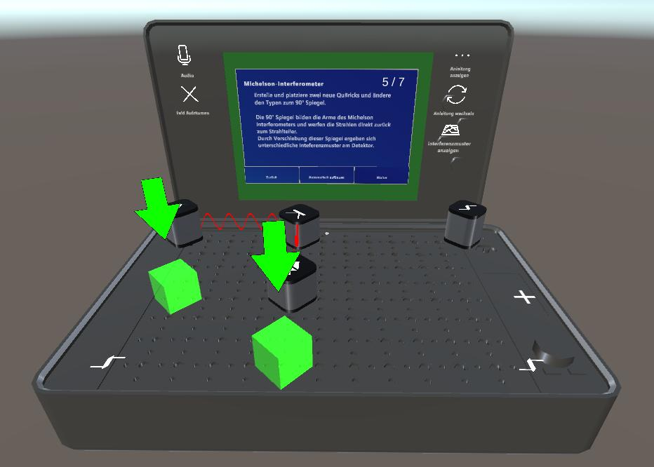

  *Figure 1: AR scene — holographic overlay on the physical QuBoard with QuBricks*

- **Full VR Scene** — fully virtual quantum suitcase with no physical hardware needed
   
   

  *Figure 2: Full VR scene — purely virtual quantum suitcase*

#### Scene Walkthrough

The app has two scenes activated via QR codes:

**AR Scene (Quantenkoffer AR)**
- The HoloLens connects to `qucase` on the Raspberry Pi by scanning the WebSocket QR code (`./qr codes/quboard_raspberry_pi_qr_code.png`).
- Real QuBricks on the physical QuBoard are detected by `qucase` (via I2C) and their state (type, rotation, setting) is transmitted over WebSocket to the HoloLens.
- Each brick's holographic representation updates in real time as you rotate its encoder or adjust its setting.
- The laser beam path is visualized interacting with the actual optical elements on the board.
- Press the laser button on the QuBoard Interface PCB to trigger the beam visualization.

> *Screenshot of AR scene with holographic overlay on QuBoard coming soon*

**Full VR Scene (Quantenkoffer VR)**
- A fully virtual quantum suitcase is placed in the real world by scanning the QR code.
- All optical elements (mirrors, beam splitters, laser path) are rendered as holograms.
- The suitcase contains virtual controls for selecting experiments and adjusting parameters.
- No physical bricks or field hardware required — purely a demonstration and teaching tool.

> *Screenshot of Full VR scene interaction coming soon*

**Switching between scenes**
- Each scene is activated by scanning its corresponding QR code with the HoloLens.
- Printable QR code images are in `./qr codes/`.
- Print the QR codes and place them in the physical environment where the HoloLens can see them.

### Prerequisites

- Unity **2021.3.30f1** with **Universal Windows Platform (UWP)** module and **IL2CPP** backend installed
- Visual Studio 2022 with the **Universal Windows Platform development** workload
- Windows SDK 10.0.19041.0 or newer
- HoloLens 2 with **Developer Mode** enabled (Settings → Update & Security → For Developers → Developer Mode)

### Installation Step by Step

1. Clone the repository:

```
git clone https://github.com/AmILabor/QuFabLab.git
```

2. Open the `hololensv2` folder as a Unity project.

3. Ensure the project uses Unity **2021.3.30f1**. Using other versions may cause compatibility issues.

4. Before opening the project in Unity, place the required **MRTK 3.0** packages into `Packages/MixedReality/`:
   - `com.microsoft.mixedreality.toolkit.foundation-3.0.0.tgz`
   - `com.microsoft.mixedreality.toolkit.standardassets-3.0.0.tgz`
   
   These can be downloaded from the [MRTK 3.0 release page](https://github.com/microsoft/MixedRealityToolkit-Unity/releases/tag/v3.0.0). Also ensure the **Microsoft Mixed Reality OpenXR** package is installed via the Mixed Reality Feature Tool or Unity Package Manager — see the [OpenXR setup guide](https://learn.microsoft.com/en-us/windows/mixed-reality/develop/unity/xr-project-setup).

5. Open the project in Unity.
   A warning may appear stating that code cannot be executed or recommending Safe Mode.
   Ignore this warning and continue.

6. In **Player Settings → Other Settings**, enable:
   - **Allow unsafe Code** (required for OpenCV)

7. In **Player Settings → Publishing Settings**, set:
   - **Minimum Platform Version**: 10.0.10240.0 or higher

8. In **Project Settings → XR Plug-in Management**, enable **OpenXR** for the **Universal Windows Platform** tab.

9. In the Unity menu, run **NuGet → Restore** to install OpenCV and other dependencies.

10. Create a UWP build via **File → Build Settings → Universal Windows Platform → Architecture: ARM64 → Build**. Select a folder outside the project directory.

11. Open the generated `QuFabLabApp.sln` in Visual Studio.

12. Configure the solution for **Release / ARM64**. For deployment to a HoloLens, set the target to **Remote Machine** and enter the HoloLens IP address (found in HoloLens Settings → Update & Security → For Developers → Enable Device Portal). Pair the device when prompted and accept the certificate from `Assets/WSATestCertificate.pfx`.

13. In Visual Studio, press **Ctrl+F5** (Start Without Debugging) to build and deploy to the HoloLens.

14. Configure the WebSocket connection. See the **WebSocket Connection** section under QuCase for AR below.

To activate the VR or AR Scene use the QR codes in "./qr codes/"

### Integrated Packages

1. Mixed Reality Toolkit 3.0
   https://learn.microsoft.com/en-us/windows/mixed-reality/mrtk-unity/mrtk3-overview/

2. NuGet for Unity
   https://github.com/GlitchEnzo/NuGetForUnity

3. Unity Localization
   https://docs.unity3d.com/Packages/com.unity.localization@1.3/manual/index.html

4. NativeWebSocket
   https://github.com/endel/NativeWebSocket.git#upm


### QR Codes

Printable QR code images are located in `./qr codes/` (also available in `./hololensv2/Assets/Resources/QRCodes/Images/` for the Unity project):

| File | Purpose |
|------|---------|
| `KOFFER_PLACEMENT.png` (or `KOFFER_PLACEMENT_Small.png`) | **Full VR scene** — scan to place the fully virtual quantum suitcase |
| `quboard_raspberry_pi_qr_code.png` | **WebSocket connection** — contains `ws://<raspberry-pi-ip>:8123`; scan with the HoloLens to connect qucase to the AR scene |

The Raspberry Pi QR code encodes the dynamic IP of the Pi's `wlan0` interface and is also printed as ASCII art in the qucase startup logs.

### Useful Tips

* Deploying the project to the HoloLens using the Release build configuration provides significantly smoother performance compared to Debug or Master builds.

 * The Localization Scene Controls can be accessed via:

```
Window -> Asset Management -> Localization
```

If a language is selected and Track Changes is set to `true`, any modifications made in the scene will automatically be stored for that language.

Alternatively, you can view and edit all translations via the String Tables, also accessible through:

```
Window -> Asset Management -> Localization
```

* The Recorder Window can be opened via:

```
Window -> General -> Recorder
```

This tool allows recording the Game View in its native resolution.


## QuBrick for AR

These steps are only required if you are using the Augmented Reality system.

### Hardware

#### Bill of Materials (per brick)

| Part | Quantity | Notes |
|------|:-------:|-------|
| QuBrick circuit board (custom PCB) | 1 | Gerber: `./AR-Quantenkoffer/Platinen/produktion - jlc/brick/` |
| XIAO SAMD21 microcontroller | 1 | |
| DEBO LCD 1.28" (GC9A01A, 240x240 round) | 1 | |
| Pogo pins (P70-2200045) | 8 | For I2C and power connection to the field |
| Jumper cables | 5 | For connecting display to PCB |
| PCF8574AN GPIO expander | 1 | With 16-pin IC socket |
| Rotary Encoder KY-040 | 1 | |
| Resistor 10kΩ | 3 | |
| Magnet Ø5mm x 2mm | 5 | For holding the brick on the field |
| Screws | 4 | For securing the top-display-fixture assembly |

#### Assembly

1. Print the 3D models from `./AR-Quantenkoffer/stls/`:
   - `brick_bottom.stl`
   - `brick_shell.stl` (or USB-nudge variant `brick_shell_+USB_nudge_V3.stl` for easier USB access on assembled bricks)
   - `display_fixture.stl`
   - `brick_top.stl`

   Tolerance variations for the brick bottom are available in `brick_bottom_variations/` if the standard version does not fit your printer (filenames encode block and circle clearances, e.g. `brick_bottom_standard_block-0.5_circle-0,4.stl`).

   You need 6 bricks for the example Michelson interferometer setup.

2. Order the brick PCB (Figure 3). Gerber files ready for JLCPCB are at `./AR-Quantenkoffer/Platinen/produktion - jlc/brick/`. The KiCad design files are at `./AR-Quantenkoffer/Platinen/brick/` (`brick_test.kicad_pcb`, `brick_test.kicad_sch`). The schematic PDF is included in `./AR-Quantenkoffer/Platinen.zip`.

   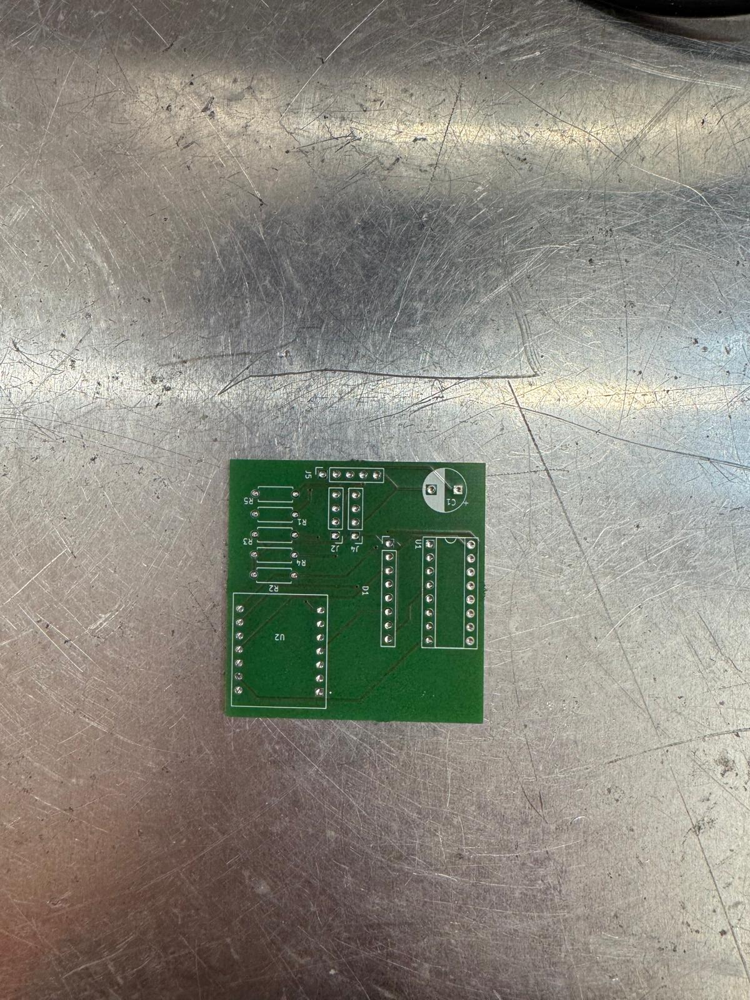

   *Figure 3: Bare brick PCB top view — the board before soldering*

3. Solder the components onto the brick PCB (Figures 4 and 5):
   - Solder the PCF8574AN IC socket (place the IC later)
   - Solder three 10kΩ resistors as shown in the schematic
   - Solder the XIAO SAMD21 (pins face downward as shown)
   - Solder the 8 pogo pin connectors

   <table>
   <tr>
   <td>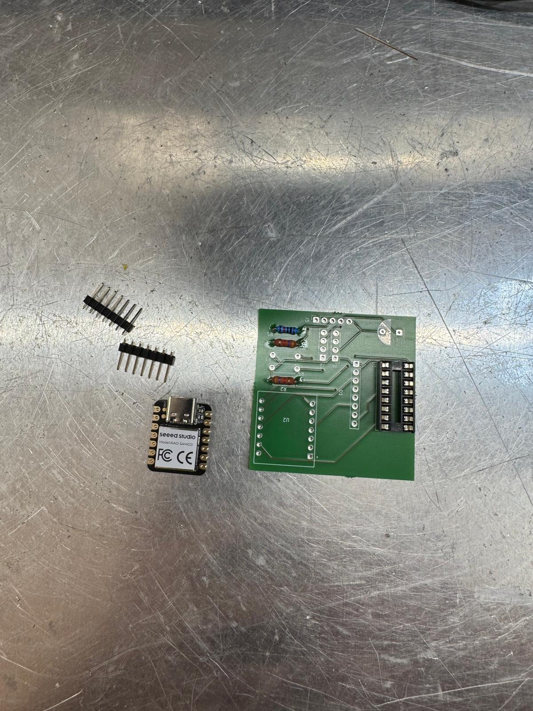<br/><em>Figure 4: Brick PCB with components laid out for soldering</em></td>
   <td>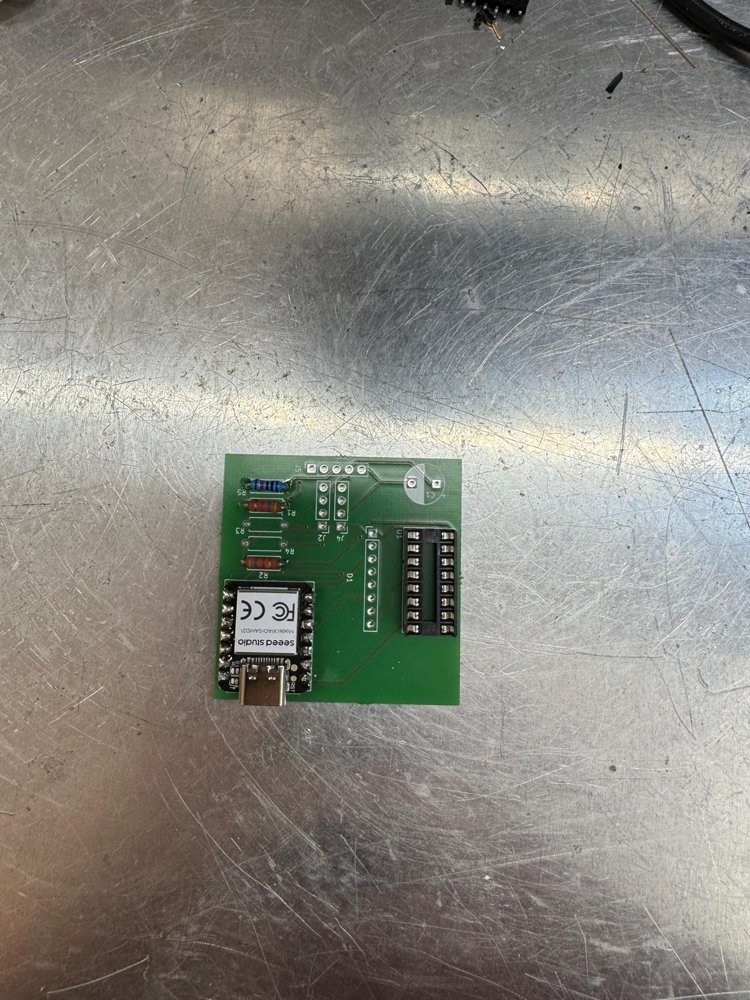<br/><em>Figure 5: Fully soldered brick PCB with XIAO, PCF8574AN, resistors, and pogo pins</em></td>
   </tr>
   </table>

4. Solder jumper cables to the display (Figure 6):
   - Connect to the display's SPI and power pads
   - Route the cables through the display_fixture

   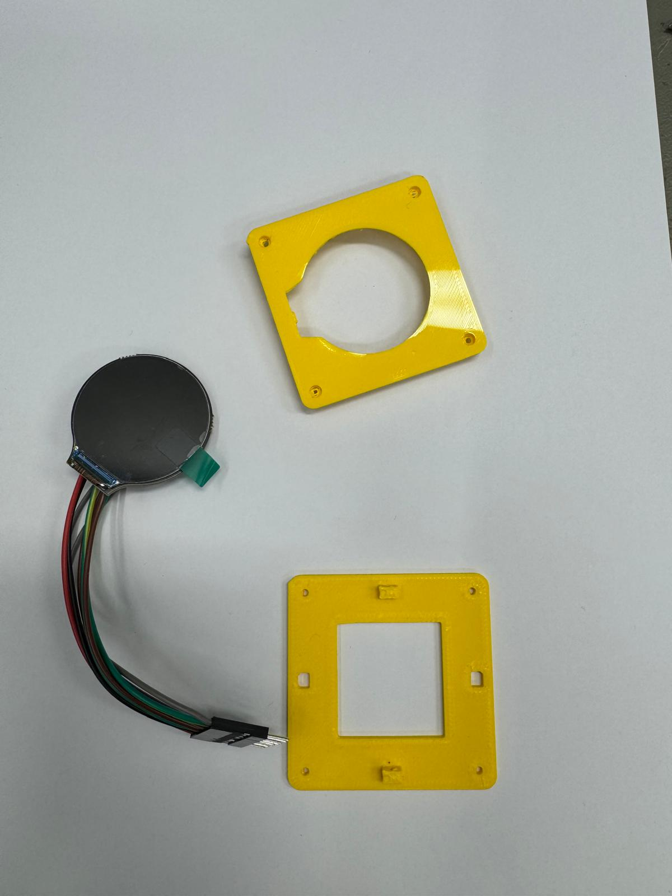

   *Figure 6: Display back side with jumper cables soldered to SPI and power pads*

5. Set magnets into the brick_bottom:
   - Glue 5 magnets (Ø5mm x 2mm) into the slots on the brick_bottom
   - Ensure polarity is consistent so bricks are held firmly on the field

6. Glue the brick_bottom to the brick_shell.

7. Insert the Rotary Encoder KY-040 into its slot in the shell and connect its pins to the QuBrick circuit board (Figure 7).

   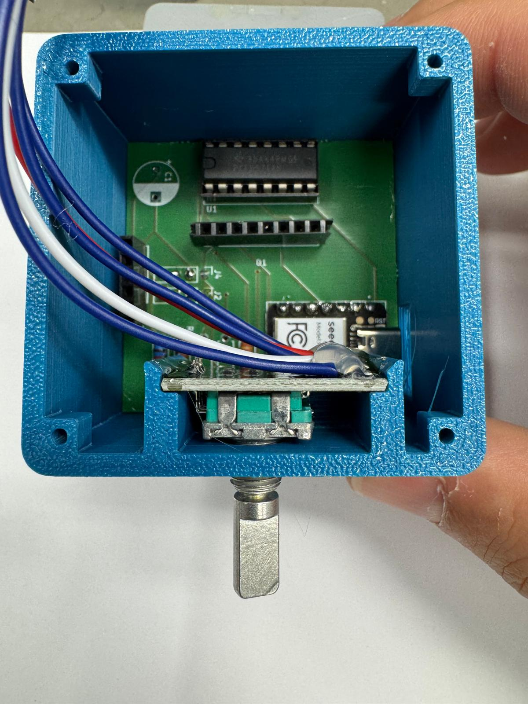

   *Figure 7: Rotary encoder KY-040 installed in the brick shell*

8. Place the display into the display_fixture, then snap the brick_top onto the display_fixture.

9. Connect the display cables to the QuBrick circuit board. Screw the combined top-display-fixture onto the brick_shell.

#### Structure
- `./AR-Quantenkoffer/ar_brick_firmware/lib/encoder` — Rotary encoder handling  
- `./AR-Quantenkoffer/ar_brick_firmware/lib/pcf8574AN` — GPIO expander driver  
- `./AR-Quantenkoffer/ar_brick_firmware/src/MenuStructure` — Menu and UI logic  

### Brick Wiring

#### Brick Schematic

For the full circuit diagram, see the brick schematic PDF in `./AR-Quantenkoffer/Platinen.zip`.

This shows the complete wiring of the XIAO SAMD21, PCF8574AN GPIO expander, GC9A01A round display, KY-040 rotary encoder, and the 8 pogo pin interface.

#### Brick-to-Field Interface (via 8 Pogo Pins)

| Pogo Pin | Signal |
|:--------:|--------|
| 1 | I2C SDA |
| 2 | I2C SCL |
| 3 | GND |
| 4 | VCC (3.3V) |
| 5-6 | Rotation jumpers (encode brick orientation) |
| 7-8 | Field matrix position detection |

The 8 pogo pins on the brick bottom make contact with corresponding pads on the field cover plate. Power and I2C are carried through pins 1–4, while pins 5-6 connect to the rotation encoding pads (read by the PCF8574AN GPIO expander) and pins 7-8 connect to the field matrix for position detection.

### Firmware Installation

#### Prerequisites
- Install **[PlatformIO](https://platformio.org/)** in VS Code (extension ID: `platformio.platformio-ide`)
- PlatformIO will auto-download dependencies listed in `platformio.ini` on first build, including:
  - `Adafruit GFX Library`, `Adafruit_GC9A01A`, `PCF8574AN`, `SoftWire`, `AsyncDelay`, `FlashStorage_SAMD`

#### Setup
1. Open the firmware folder in VS Code: `./AR-Quantenkoffer/ar_brick_firmware/`
2. Wait for PlatformIO to initialize (bottom bar shows PlatformIO status)
3. PlatformIO will auto-detect the `seeed_xiao` environment from `platformio.ini`. Ensure the environment in the footer bar shows **seeed_xiao** before building.

4. In `src/main.cpp:23`, set a **unique I2C address** for each brick. The XIAO SAMD21 uses the hardware I2C peripheral (addresses 0x08–0x77 are valid on the SAMD21). Recommended range for 6 bricks:

   ```
   #define I2C_ADDR  0x66
   ```

   Use any **6 consecutive addresses** in the range `0x60`–`0x6F` (e.g. `0x66` to `0x6B`). Each brick must have a different address for the system to detect them correctly. The Raspberry Pi scans the entire I2C bus on startup, so addresses outside this range also work as long as they are unique and do not conflict with the PCF8574AN (address `0x38`).

5. Build the firmware by clicking PlatformIO's **Build** (**✓** icon in the VS Code footer) or run:

   ```
   platformio run
   ```

6. Connect the XIAO SAMD21 microcontroller via USB.

7. Upload the firmware:

   - Click the **→ (PlatformIO: Upload)** arrow in the VS Code footer, or run:

     ```
     platformio run --target upload
     ```

8. Verify the upload:
   - Open the **Serial Monitor** (plug icon in VS Code footer, baud: 9600)
   - On success, the display lights up and the menu appears
   - If serial shows `ERROR: cannot communicate to PCF8574A`, check soldering and I2C connections

9. Repeat steps 4-8 for each brick (6 bricks for the Michelson interferometer setup).

#### Re-flashing an Assembled Brick

If you need to update the firmware after the brick has been assembled (e.g. to change the I2C address or apply a bug fix):

1. Connect the XIAO SAMD21 to your computer via the **micro-USB cable** while the brick is still assembled — the USB port is accessible through the brick shell.
2. Open the firmware folder in VS Code: `./AR-Quantenkoffer/ar_brick_firmware/`
3. Make your changes in `src/main.cpp` (e.g. update `#define I2C_ADDR  0x66` on line 23).
4. Click the **→ (PlatformIO: Upload)** arrow in the VS Code footer, or run `platformio run --target upload`.
5. Open the **Serial Monitor** (baud: 9600) to verify the brick boots correctly.
6. The brick retains its last persisted type and setting across re-flashes (stored in flash memory via `FlashStorage_SAMD`), so you do not need to reconfigure it after the update.

> *Photo of a brick being re-flashed via USB coming soon*

#### Hardware Reference
- A wiring diagram for the pogo pin connections is available at `./AR-Quantenkoffer/ar_brick_firmware/images/pogo_pin.png`

##### Brick Firmware Pinout (defined in `main.cpp`)

| Pin / Address | Function |
|:-------------:|----------|
| XIAO pin 0 (CS) | TFT chip select (`TFT_CS`) |
| XIAO pin 3 (DC) | TFT data/command (`TFT_DC`) |
| XIAO pin 1 | Rotary encoder CLK |
| XIAO pin 2 | Rotary encoder DT |
| XIAO pin 9 | Rotary encoder SW (button) |
| XIAO pin 6 (SW SCL) | Software I2C clock to PCF8574AN |
| XIAO pin 7 (SW SDA) | Software I2C data to PCF8574AN |
| XIAO SDA/SCL (HW I2C) | Connected to pogo pins for RPi communication |

##### PCF8574AN GPIO Expander Mapping

| PCF Pin | Function | I2C Address |
|:-------:|----------|:-----------:|
| 0 | Display backlight (`PCF_BACKLIGHT`) | — |
| 1 | Rotation jumper P1 (`PCF_ROT_JUMPER_P1`) | — |
| 2 | Rotation jumper P2 (`PCF_ROT_JUMPER_P2`) | — |
| 3 | Occupied detection jumper (`PCF_OC_JUMPER`) | — |
| — | Device address | **0x38** |

##### Settings Persistence

The firmware uses `FlashStorage_SAMD` to persist the brick type and setting value across power cycles (`settingPersistence.hpp`). Data is stored in emulated EEPROM:

| EEPROM Offset | Data |
|:-------------:|------|
| 0 | Brick type |
| 1 | Setting value (low byte) |
| 2 | Setting value (high byte) |

Settings are saved automatically whenever the type or setting changes. On boot, the brick restores its last type and setting from flash memory.

### System Behavior

- Each brick uses I2C address scanning by the Raspberry Pi for detection. Set a unique address per brick in `main.cpp`.
- On boot, the brick initializes its display and menu. The display shows a "not connected" indicator until the first I2C poll from the Raspberry Pi.
- **Insert bricks one at a time.** Wait for a brick to fully boot before inserting the next. Inserting multiple bricks too quickly may cause incorrect position detection.
- If the display stays white or black, check the TFT wiring (`TFT_CS` and `TFT_DC` pins in `main.cpp`) and that the backlight GPIO is connected.

#### Rotation Detection

Each brick determines its orientation on the field via **2 rotation jumpers** on the PCB, connected to PCF8574AN pins 1 and 2 (see the brick schematic in `./AR-Quantenkoffer/Platinen.zip`). When the brick is placed on the field, these jumpers connect to different pads depending on the brick's rotation, encoding a 2-bit value:

- `00` = North, `01` = South, `10` = East, `11` = West

The firmware reads the jumper state on each loop cycle (`readRotationJumpers()` in `main.cpp`) and stores the result in the `ROTATION_REGISTER` (0x13), which the Raspberry Pi reads via I2C. This rotation, combined with the field matrix position, tells the system exactly where and how the brick is oriented.

#### Position Detection (Field Matrix Scan)

The field is scanned as a **6 × 5 matrix** (6 column outputs × 5 row inputs). When `qucase` detects a new I2C device on the bus, it pulses each column GPIO high and reads the row GPIOs to determine the exact (X, Y) position of the newly placed brick.

### Menu Controls

- **Rotate encoder** → Change brick type
- **Press button** → Enter adjustment mode (if the current type supports settings)
- **Press again** → Return to type selection

#### Brick Types

| ID | Type | Display Name | Has Setting | Description |
|:--:|------|--------------|:-----------:|-------------|
| 0 | BeamSplitter | Strahlteiler | No | Splits incoming laser beam |
| 1 | Mirror90 | 90 Spiegel | **Yes** — distance (-10 to +10, step 0.1) | 90° mirror with adjustable mirror distance |
| 2 | Mirror45 | 45 Spiegel | No | 45° mirror |
| 3 | Periscope | Periskop | No | Periscope entry (currently commented out in firmware) |

- For types without a setting, pressing the button has no effect.
- The Mirror90 adjustment changes the apparent distance of the mirror, rendered as a movable bar on the display.
- Rotating the encoder while in adjustment mode changes the setting value; pressing the button returns to type selection.

## QuCase for AR

### Hardware

#### Bill of Materials

| Part | Quantity | Notes |
|------|:-------:|-------|
| Raspberry Pi 3 Model B | 1 | Other variants (3B+, 4, Zero 2W) likely work but are untested |
| GPIO header angle adapter (BerryBase) | 1 | |
| QuBoard Interface PCB | 1 | Connects QuBoard to Raspberry Pi — schematic in `./AR-Quantenkoffer/Platinen.zip` |
| QuBoard (field PCB) | 1 | Printed as **2 halves** and connected together — Gerber: `./AR-Quantenkoffer/Platinen/produktion - jlc/bottom/` |
| DC power connector 5.5mm x 2.1mm | 1 | |
| Power supply 5V / 6A / 30W | 1 | |
| Rocker switch I-O, black | 2 | |
| Miniature push button 0.5A-24VAC, red | 1 | |
| Voltage regulator 5V→3.3V 1.5A | 2 | |
| SMD fuse fast acting 5A 500Vdc | 1 | |
| Resistor 10kΩ (CRCW2512 1%) | 1 | |
| Resistor 68Ω (3521 2W 1%) | 4 | |
| Tantalum capacitor 10µF 35VDC (2412/6032) | 4 | |
| LED SMD 1210 green (171 mcd) | 2 | |
| LED SMD 1210 yellow (362 mcd) | 2 | |
| LED SMD 1210 red (417 mcd) | 2 | |
| PCB terminal block 6-pin RM 2.54mm | 1 | |
| PCB terminal block 10-pin RM 2.54mm | 2 | |
| PCB terminal block 2-pin RM 2.54mm | 2 | |
| Pin header 2x20, gold-plated, 2.54mm | 1 | |
| Raspberry Pi mount (3D print) | 1 | `./AR-Quantenkoffer/stls/pi_mount.stl` |

#### Assembly

1. **Order the PCBs.** Gerber files ready for JLCPCB:
   - QuBoard (2 halves): `./AR-Quantenkoffer/Platinen/produktion - jlc/bottom/`
   - QuBrick circuit boards: `./AR-Quantenkoffer/Platinen/produktion - jlc/brick/`
   
   KiCad source files are at `./AR-Quantenkoffer/Platinen/feld/` and `./AR-Quantenkoffer/Platinen/brick/`.
   PDF schematics are bundled in `./AR-Quantenkoffer/Platinen.zip` (includes Interface PCB, field PCB, and brick PCB schematics).

2. **3D-print the mechanical parts** from `./AR-Quantenkoffer/stls/`:
   - `pcb_holder_field.stl` or `PCB_holder_field_skalierbar.stl` (scalable version) — holds the field PCBs; print **2 halves** (each covering 3×5 positions). The halves are split between columns 3 and 4 — they connect only through the row identification cables to the Interface PCB, with no direct electrical connections between column 3 and 4
   - `pi_mount.stl` — holds the Raspberry Pi
   - `pcb_cover_plate.stl` (or reduced versions `PCB_cover_platte_0,1_reduziert.stl` / `PCB_cover_platte_0,2_reduziert.stl`) — covers the field PCBs, holds magnets (print 30 times)
   - `brick_bottom.stl`, `brick_shell.stl`, `display_fixture.stl`, `brick_top.stl` — brick enclosure (print 6 each)
   - `PCB_Kabelkanal_1.1.stl` and `PCB_Kabelkanaldeckel_1.1.stl` — cable channel and lid, screwed to the QuBoard
   - `PCB_Grundplatte_Platinengehäuse_V3.stl` and `PCB_Qfab_Deckel.stl` — base plate and lid for the electronics housing, screwed to the QuBoard
   - `PCB_nutcover.stl` — covers the nuts used to screw the cable channel and housing to the QuBoard
   - `brick_shell_+USB_nudge_V2.stl` / `brick_shell_+USB_nudge_V3.stl` — alternative brick shells with USB access

   Autodesk Inventor source files (`.ipt`) for most parts are in `./AR-Quantenkoffer/inventor_files/`. STEP files for the PCBs are at `./AR-Quantenkoffer/Platinen/brick/brick_test.step` and `./AR-Quantenkoffer/Platinen/feld/bottom_test.step`. Additional 3D printer project files (`.3mf`, `.ufp`) can be found alongside the STLs.

3. **Solder the QuBoard Interface PCB (Figure 8):**
   - Solder the voltage regulators, resistors, capacitors, fuses, and LEDs as marked on the PCB
   - Solder the terminal blocks (2-pin, 6-pin, 10-pin)
   - Solder the GPIO header (2x20) and the DC power connector
   - Solder the rocker switch and push button

   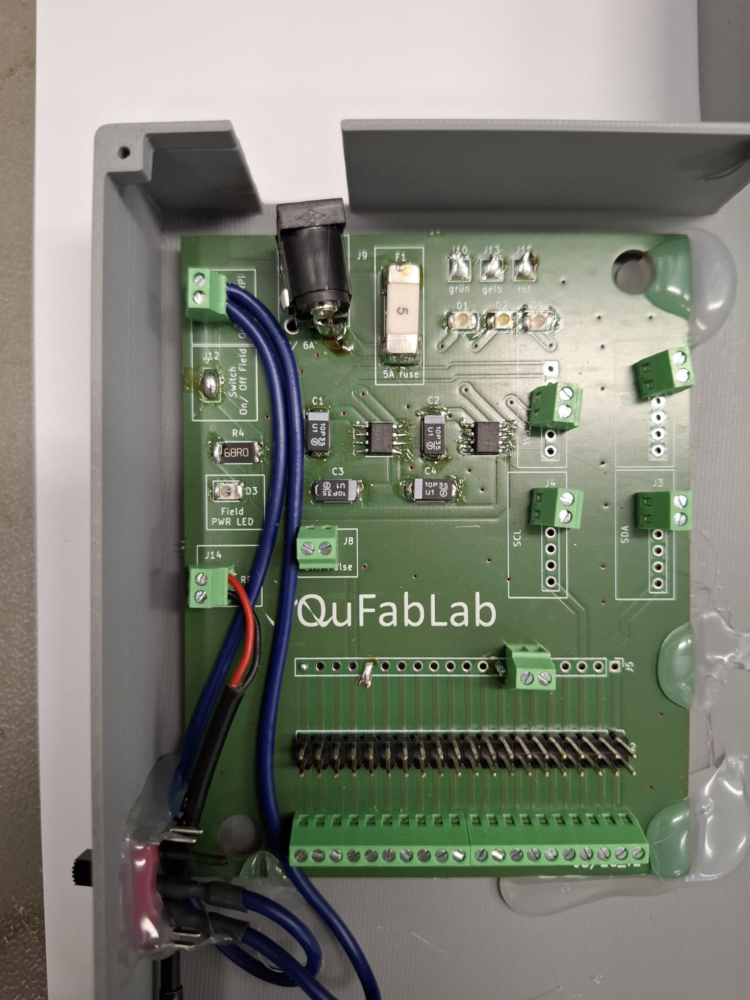

   *Figure 8: QuBoard Interface PCB with voltage regulators, terminal blocks, GPIO header, and connectors*

4. **Solder the QuBoard halves (Figure 9):**
   - Place each QuBoard half into the slots of the `pcb_holder_field`
   - Solder the pogo pin contacts for each brick position
   - Solder column and row wires from the sensor boards to the terminal blocks

   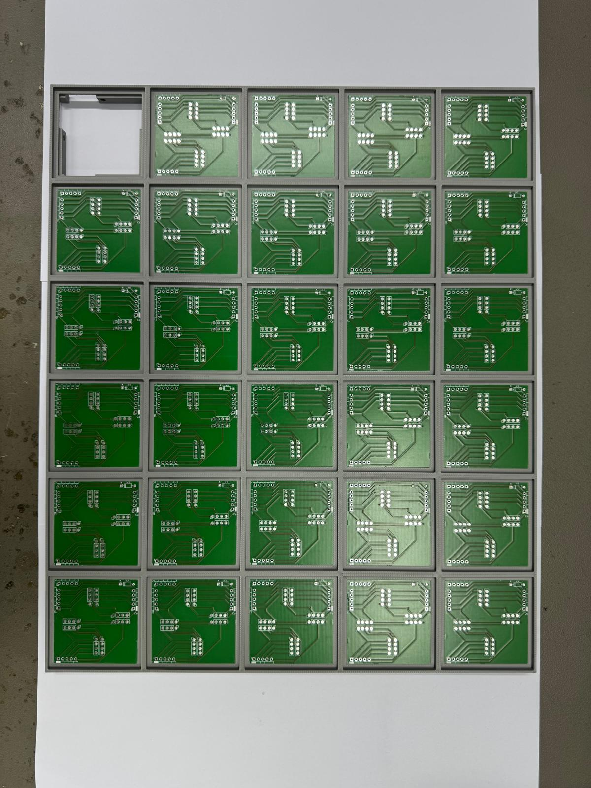

   *Figure 9: Sensor boards installed in the pcb_holder_field with pogo pin contacts*

5. **Wire the field halves to the Interface PCB.** the QuBoard halves connect via **5-pin inter-board connectors**. VCC, GND, SDA, and SCL enter from the QuBoard Interface PCB at only **2 modules** — any top-row module on each half. From there:
   - **Every column** (vertical) is **fully connected with all 5 pins** — power and I2C flow downward through each column to the lower modules.
   - **The top row** (horizontal across the top) is **fully connected with all 5 pins**.
   - **Every other row** (horizontal across lower rows) carries **only the row identifier** — no VCC, GND, SDA, or SCL between adjacent rows.
   - **Row identification** — each of the 5 rows has its **own cable** going directly to the QuBoard Interface PCB.
   - **Column identification** — each of the 6 columns has its **own cable** going directly to the QuBoard Interface PCB.

6. **Connect the Interface PCB to the Raspberry Pi (Figure 10):**
   - The QuBoard Interface PCB aggregates all field cables and connects them to the Raspberry Pi via the **2×20 GPIO header** (using the angle adapter)
   - Each row and column in the field matrix has a dedicated trace for rotation detection
   - The Interface PCB also hosts the LEDs, laser button, voltage regulators, fuses, and terminal blocks for easy wiring

   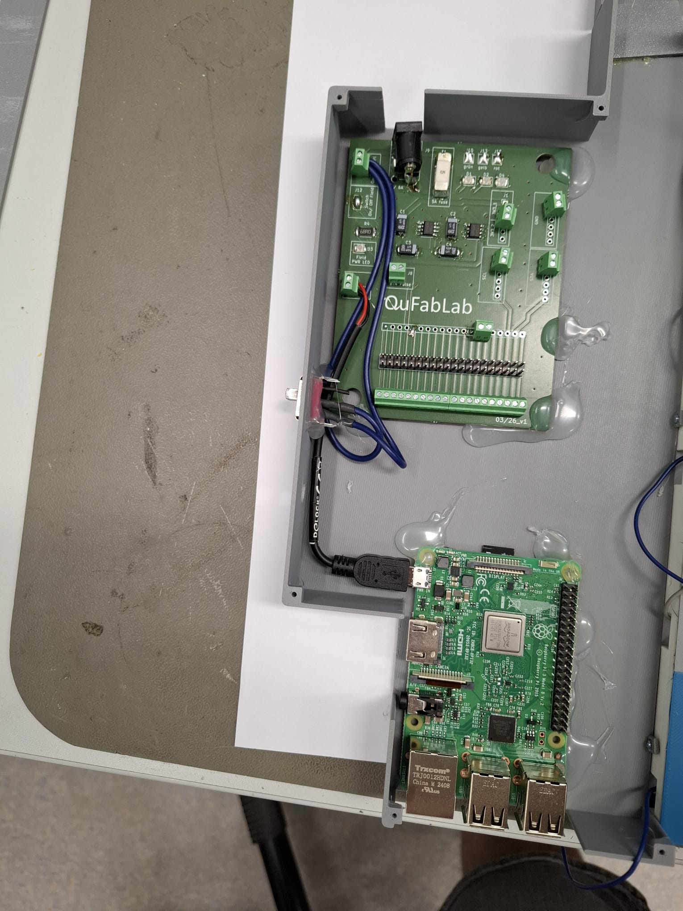

   *Figure 10: QuBoard Interface PCB connected to the Raspberry Pi via the GPIO header*

7. **Assemble the pcb_cover_plate (Figure 11):**
   - Insert magnets (Ø5mm x 1mm) into the slots on the cover plate
   - Either pause the print mid-way, insert magnets, and let it finish (encapsulating them in PLA), or glue them in after printing

   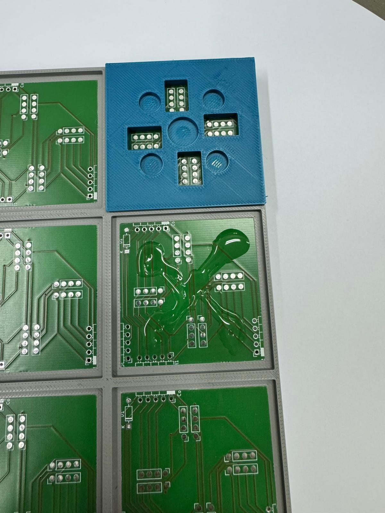

   *Figure 11: PCB cover plate with integrated magnets mounted on the field*

8. **Mount all components (Figure 12):**
   - Place the Raspberry Pi into its 3D-printed mount
   - Place the QuBoard Interface PCB into its holder
   - Place the cover plates over the QuBoard
   - Connect the power supply (5V / 6A) to the DC connector

   

   *Figure 12: Completed field assembly with cover plates in place*

### Field Matrix Wiring

The QuBoard is built from **QuBoard modules** connected via **5-pin inter-board connectors**. The current 6×5 matrix is split into **two halves** between columns 3 and 4 — the halves are electrically connected only through the row identification cables to the Interface PCB, with no direct connections between column 3 and 4. The design is not limited to this shape; modules can be arranged in **any configuration**, allowing the field to be expanded or shrunk as needed.

**Signal distribution:**
- **Every column** (vertical between modules) is **fully connected with all 5 signals** (VCC, GND, SDA, SCL, plus the column/row identification).
- **The top row** (horizontal across the top row of modules) is **fully connected with all 5 signals**. The 5-pin inter-board connectors on the top row can be placed at any position — they are not limited to specific column positions.
- **Every other row** (horizontal across lower rows of modules) carries **only the row identification signal** — no VCC, GND, SDA, or SCL across lower rows; power and I2C reach them vertically through the columns.

**External connections to the Interface PCB:**
- **VCC, GND, SDA, SCL** — these 4 signals come from the QuBoard Interface PCB to only **2 modules**: any top-row module on each half. They spread to the other modules vertically through the columns, not horizontally across lower rows.
- **Row identification** — each row has its **own cable** going directly to the QuBoard Interface PCB (one per row, see Figures 13 and 14).
- **Column identification** — each column has its **own cable** going directly to the QuBoard Interface PCB (one per column, see Figures 13 and 14).

VCC, GND, SDA, and SCL are distributed vertically through the columns and reach every module. Only the **top row** carries them horizontally — lower rows carry only the identification signal across horizontally.

The QuBoard routes these signals through the cover plate's pogo pin pads to each brick position. When a brick is placed, power and I2C connect through pins 1–4 of the pogo interface, while pins 5-6 connect to the rotation encoding traces and pins 7-8 connect to the position detection traces.

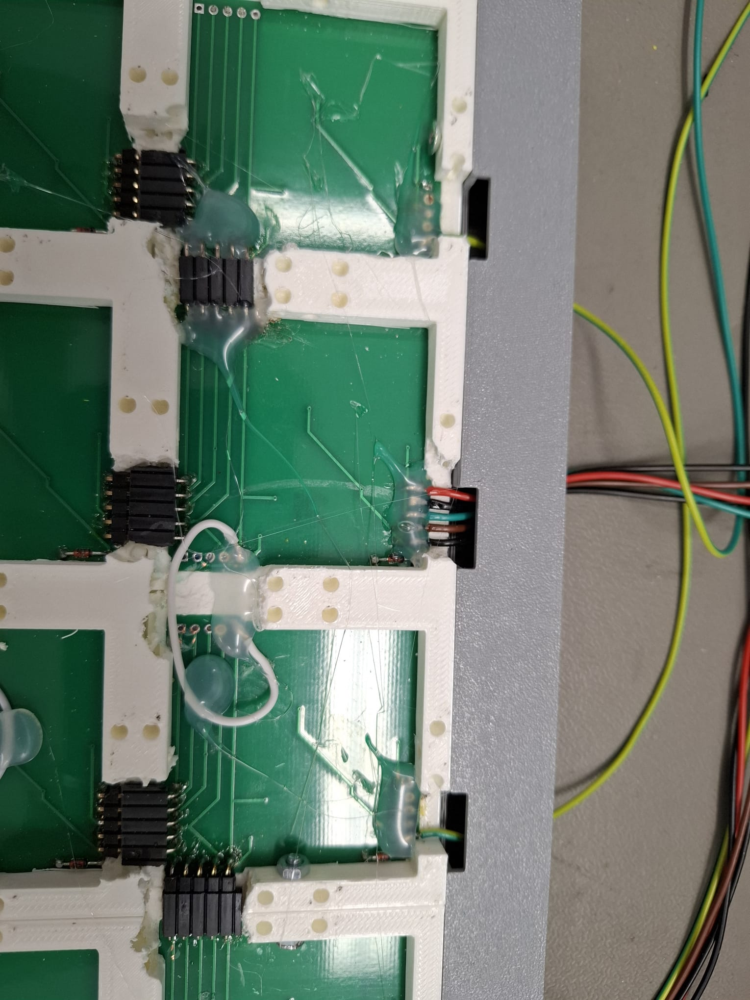
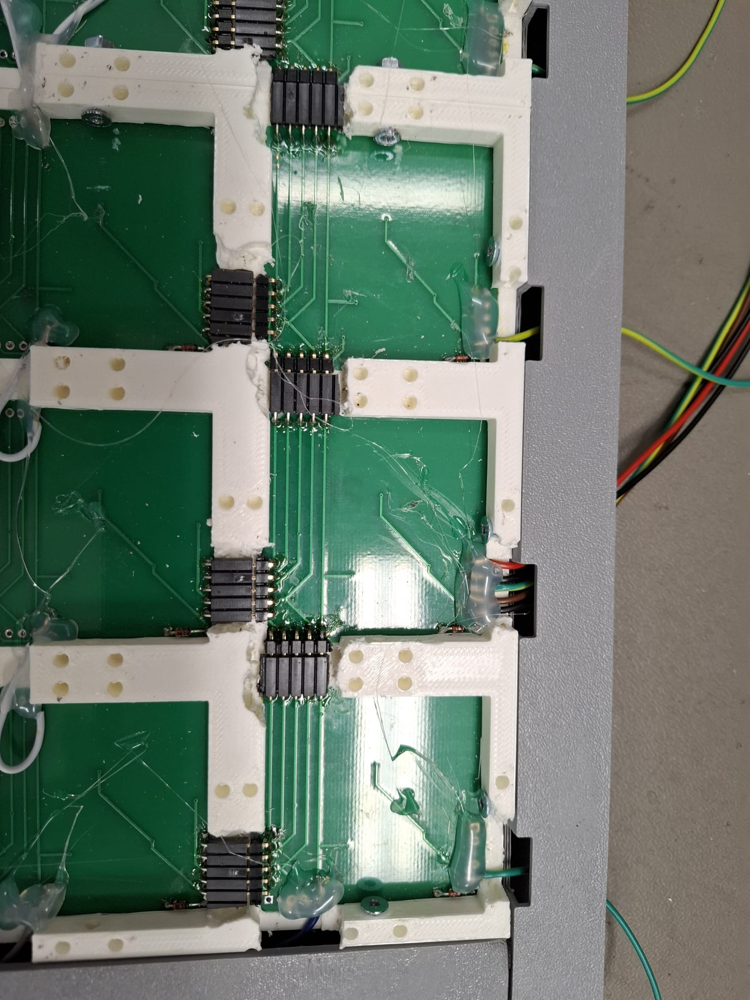

*Figures 13 and 14: Row and column identification cables connected to the QuBoard (right and left side views)*

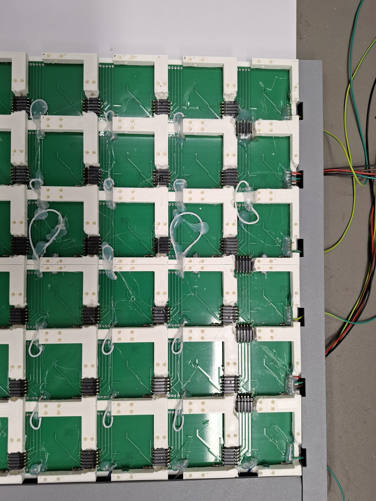

*Figure 15: Backside view of the field with cables routed to the Interface PCB*

### LED Indicators

| Color | GPIO | Meaning |
|-------|:----:|---------|
| Red | 5 | **Error** — on when a brick read error or board error is detected (e.g. I2C communication failure) |
| Yellow | 22 | **Setup complete** — on when all required bricks are placed with correct type and rotation (Michelson interferometer configuration) |
| Green | 26 | **System ready** — on when bricks can be placed; turns off during brick detection and placement |

The red and yellow LEDs are controlled by `qucase` based on runtime checks:
- Red LED state is updated on each scan cycle (every ~100ms)
- Yellow LED reflects the result of `check_setup_complete()` which validates the `REQUIRED_BRICK_CONFIG` (see below)

### Required Brick Configuration (Michelson Interferometer)

The system validates that bricks are placed in the correct positions with the correct type and rotation. The yellow LED lights up only when all requirements are met. The expected layout is (t = type number, N/S/E/W = cardinal direction of rotation):

<table style="border-collapse: collapse;">
<tr><th style="border: 1px solid #999; width: 50px; height: 55px;"></th><th style="border: 1px solid #999; width: 50px; height: 55px;">0</th><th style="border: 1px solid #999; width: 50px; height: 55px;">1</th><th style="border: 1px solid #999; width: 50px; height: 55px;">2</th><th style="border: 1px solid #999; width: 50px; height: 55px;">3</th><th style="border: 1px solid #999; width: 50px; height: 55px;">4</th><th style="border: 1px solid #999; width: 50px; height: 55px;">5</th></tr>
<tr><th style="border: 1px solid #999; width: 50px; height: 55px;">0</th><td align="center" style="border: 1px solid #999; width: 50px; height: 55px;">·</td><td align="center" style="border: 1px solid #999; width: 50px; height: 55px;">·</td><td align="center" style="border: 1px solid #999; width: 50px; height: 55px;">M45<br/><small>t2 N</small></td><td align="center" style="border: 1px solid #999; width: 50px; height: 55px;">·</td><td align="center" style="border: 1px solid #999; width: 50px; height: 55px;">M45<br/><small>t2 W</small></td><td align="center" style="border: 1px solid #999; width: 50px; height: 55px;">·</td></tr>
<tr><th style="border: 1px solid #999; width: 50px; height: 55px;">1</th><td align="center" style="border: 1px solid #999; width: 50px; height: 55px;">·</td><td align="center" style="border: 1px solid #999; width: 50px; height: 55px;">·</td><td align="center" style="border: 1px solid #999; width: 50px; height: 55px;">·</td><td align="center" style="border: 1px solid #999; width: 50px; height: 55px;">·</td><td align="center" style="border: 1px solid #999; width: 50px; height: 55px;">·</td><td align="center" style="border: 1px solid #999; width: 50px; height: 55px;">·</td></tr>
<tr><th style="border: 1px solid #999; width: 50px; height: 55px;">2</th><td align="center" style="border: 1px solid #999; width: 50px; height: 55px;">M90<br/><small>t1 W</small></td><td align="center" style="border: 1px solid #999; width: 50px; height: 55px;">·</td><td align="center" style="border: 1px solid #999; width: 50px; height: 55px;">BS<br/><small>t0 S</small></td><td align="center" style="border: 1px solid #999; width: 50px; height: 55px;">·</td><td align="center" style="border: 1px solid #999; width: 50px; height: 55px;">M45<br/><small>t2 S</small></td><td align="center" style="border: 1px solid #999; width: 50px; height: 55px;">·</td></tr>
<tr><th style="border: 1px solid #999; width: 50px; height: 55px;">3</th><td align="center" style="border: 1px solid #999; width: 50px; height: 55px;">·</td><td align="center" style="border: 1px solid #999; width: 50px; height: 55px;">·</td><td align="center" style="border: 1px solid #999; width: 50px; height: 55px;">·</td><td align="center" style="border: 1px solid #999; width: 50px; height: 55px;">·</td><td align="center" style="border: 1px solid #999; width: 50px; height: 55px;">·</td><td align="center" style="border: 1px solid #999; width: 50px; height: 55px;">·</td></tr>
<tr><th style="border: 1px solid #999; width: 50px; height: 55px;">4</th><td align="center" style="border: 1px solid #999; width: 50px; height: 55px;">·</td><td align="center" style="border: 1px solid #999; width: 50px; height: 55px;">·</td><td align="center" style="border: 1px solid #999; width: 50px; height: 55px;">M90<br/><small>t1 E</small></td><td align="center" style="border: 1px solid #999; width: 50px; height: 55px;">·</td><td align="center" style="border: 1px solid #999; width: 50px; height: 55px;">·</td><td align="center" style="border: 1px solid #999; width: 50px; height: 55px;">·</td></tr>
</table>

This configuration is defined in `QuBoard.py:REQUIRED_BRICK_CONFIG`.

> *Photo of the completed Michelson interferometer setup coming soon*

### Laser Start Button

The QuBoard Interface PCB includes a miniature red push button connected to **GPIO 13** that triggers a laser start command. When pressed:
1. The button state is debounced (1.5s cooldown via `LASER_FIRE_TIMEOUT`)
2. A `{"command": "start"}` message is broadcast via WebSocket to all connected clients

The button is defined in `config.py`:
- `LASER_START_INPUT = 13`
- `LASER_FIRE_TIMEOUT = 1.5` (seconds)

### GPIO Reference

The field uses a **6 × 5 matrix** — 6 column outputs and 5 row inputs (30 brick positions, configured in `config.py`):

| GPIO | Function | Direction | Notes |
|:----:|----------|:---------:|-------|
| 5 | Red LED (error) | Out | |
| 22 | Yellow LED (setup complete) | Out | |
| 26 | Green LED (system ready) | Out | |
| 13 | Laser start button | In | Pull-down, active high |
| 14,15,18,17,27,23 | Column outputs (field matrix, X axis) | Out | Active-high scan outputs |
| 24,8,21,20,16 | Row inputs (field matrix, Y axis) | In | Pull-down, scan inputs. GPIO 16 is set high on startup and also used as a row input during scanning |

### I2C Register Map

Bricks communicate over I2C using the following register addresses (defined in `config.py` and the firmware `main.cpp`):

| Register | Address | Direction | Description |
|----------|:-------:|:---------:|-------------|
| `TYPE_REGISTER` | 0x10 | Read | Brick type (0-3) |
| `SETTING_REGISTER0` | 0x11 | Read | Setting value low byte |
| `SETTING_REGISTER1` | 0x12 | Read | Setting value high byte |
| `ROTATION_REGISTER` | 0x13 | Read | Brick rotation (0-3) |
| `STORE_SETTINGS` | 0x14 | Write | Trigger persistence save on brick |

The setting value is read as a **signed 16-bit little-endian integer** from registers 0x11–0x12 and divided by 10 to produce the floating-point value (e.g. `25` → 2.5, `-10` → -1.0). Range is -10.0 to +10.0 for Mirror90.

The PCF8574AN GPIO expander on each brick uses I2C address **0x38**.

### Raspberry Pi Installation

1. **Set up the Raspberry Pi OS.** Install Raspberry Pi OS (Bullseye or newer recommended) on a microSD card. Enable SSH on first boot. A tutorial can be found [here](https://www.raspberrypi.com/documentation/computers/getting-started.html).

2. **Enable I2C.** Run `sudo raspi-config`, go to **Interface Options → I2C → Enable**. Reboot.

3. **Install dependencies:**
   ```bash
   sudo apt update
   sudo apt install -y python3-pip python3-venv i2c-tools
   ```

4. **Place the qucase software** on the Raspberry Pi. Copy the contents of `./AR-Quantenkoffer/qucase/` to `/home/pi/qucase/`:
   ```bash
   scp -r AR-Quantenkoffer/qucase/ pi@<raspberry-pi-ip>:/home/pi/qucase/
   ```

5. **Set up a Python virtual environment:**
   ```bash
   cd /home/pi/qucase/
   python3 -m venv venv
   source venv/bin/activate
   pip install -r requirements.txt
   ```

   The `requirements.txt` includes: `adafruit-blinka`, `websocket-server`, `qrcode`.

6. **Configure the Raspberry Pi as a wireless access point** so the HoloLens can connect directly. Follow the [official guide](https://www.raspberrypi.com/documentation/computers/configuration.html#host-a-wireless-network-from-your-raspberry-pi) or use `raspi-config`:
   ```bash
   sudo raspi-config
   ```
   Go to **System Options → Wireless LAN → Set as access point**. Set the SSID and password.

7. **Enable qucase to start on boot** using a systemd service. Create `/etc/systemd/system/qucase.service`:
   ```ini
   [Unit]
   Description=QuFabLab qucase Backend
   After=network.target

   [Service]
   ExecStart=/home/pi/qucase/startup.sh
   WorkingDirectory=/home/pi/qucase
   Restart=always
   User=pi

   [Install]
   WantedBy=multi-user.target
   ```
   Then enable it:
   ```bash
   sudo systemctl enable qucase.service
   sudo systemctl start qucase.service
   ```

8. **Verify the setup.** Check that qucase is running:
   ```bash
   sudo systemctl status qucase.service
   ```
   The green LED on the QuBoard Interface PCB should light up. Scan the QR code shown in the logs with the HoloLens to connect.

9. **(Optional) Testing mode.** Run qucase in testing mode to debug brick detection and WebSocket communication without the field hardware. This mode emulates a virtual board and accepts interactive commands:

   ```bash
   cd /home/pi/qucase
   source venv/bin/activate
   python main.py --testing
   ```

   **Testing mode CLI commands:**

   | Command | Syntax | Description |
   |:-------:|--------|-------------|
   | `a` | `#a x y type rotation` | Add a virtual brick at position (x,y) with given type and rotation |
   | `d` | `#d x y` | Remove virtual brick at position (x,y) |
   | `s` | `#s x y value` | Set the setting value of the brick at (x,y) |
   | `l` | `#l` | Broadcast laser start command to WebSocket clients |
   | `m` | `#m` | Create the full Michelson interferometer configuration (6 bricks) |
   | `help` | `#help` | Print the help menu |

   **Parameters:**
   - `x`: 0-7, `y`: 0-10 (testing board dimensions — the virtual testing board is 8×11, unlike the real 6×5 field)
   - `type`: 0 (BeamSplitter), 1 (Mirror90), 2 (Mirror45), 3 (Periscope)
   - `rotation`: 0 (North), 1 (South), 2 (East), 3 (West)
   - `value`: numeric setting (-10 to +10 for Mirror90, stored as signed 16-bit integer / 10)

   **Notes:**
   - On real hardware, the system includes a **10-second startup delay** (`time.sleep(10)` in `main.py`) to allow the Raspberry Pi and I2C bus to stabilize before scanning begins. In testing mode this delay still applies.
   - The `m` command uses testing-board coordinates which differ from the real field layout (e.g. a Michelson brick at (2,0) on the real field maps to a different position in testing mode).
   - The testing board is also accessible via `startup.sh --testing` (the script passes arguments through to `main.py`).

### WebSocket Connection

- qucase runs a WebSocket server on **port 8123** by default
- The IP is automatically detected from the `wlan0` interface
- On startup, qucase generates a QR code containing `ws://<ip>:8123` (printed as ASCII art in the terminal)
- A printable version is also available at `./qr codes/quboard_raspberry_pi_qr_code.png` — scan this with the HoloLens to establish the connection
- To configure manually, set the server URL in the HoloLens app to `ws://<raspberry-pi-ip>:8123`

#### WebSocket Message Format

qucase broadcasts the following JSON messages to all connected WebSocket clients:

| Event | Format | Description |
|-------|--------|-------------|
| Place | `{"command": "place", "posX": int, "posY": int, "rotation": int, "type": int}` | A brick was placed or its type/rotation changed |
| Remove | `{"command": "remove", "posX": int, "posY": int}` | A brick was removed from the field |
| Setting | `{"command": "setting", "posX": int, "posY": int, "value": float, "type": int, "rotation": int}` | A brick's setting value was adjusted |
| Start | `{"command": "start", "posX": -1, "posY": -1}` | Laser start button was pressed |

A separate **logging server** is available at `qucase/logging_server.py` (port **8080**) for debugging the HoloLens Unity client.

## Usage

Once everything is assembled and running, the workflow is:

1. **Power on** the QuFabLab field (5V / 6A supply). The Raspberry Pi boots, starts `qucase`, and the **green LED** lights up to signal readiness.
2. **Scan the QR code** shown in the RPi terminal with the HoloLens to establish the WebSocket connection. The HoloLens app displays the quantum suitcase AR overlay.
3. **Place bricks one at a time** onto the field in the correct Michelson interferometer configuration (see [Required Brick Configuration](#required-brick-configuration-michelson-interferometer)). The **yellow LED** lights up when the setup is complete.
4. **Use the HoloLens** to view the virtual laser beam path through the optical elements. Rotate the brick encoders to change element types; press to enter adjustment mode (Mirror90 only).
5. **Press the red laser button** on the QuBoard Interface PCB to send a `"start"` command. The HoloLens visualizes the laser beam interacting with the optical elements.
6. **Modify the setup** by swapping brick types (rotate encoder), adjusting mirror distances (press encoder then rotate), or moving bricks to different positions.

## Troubleshooting

### Unity Issues
| Problem | Solution |
|---------|----------|
| Safe Mode warning on project open | Ignore and continue — code execution warning is expected for UWP projects |
| Build errors | Ensure **Allow unsafe Code** is enabled in Player Settings → Other Settings |
| NuGet restore fails | Check internet connection; manually download OpenCV packages if needed |
| HoloLens app crashes on startup | Verify MRTK 3.0 packages are in the correct folder (`Packages/MixedReality/`) |

### Deployment Issues
| Problem | Solution |
|---------|----------|
| Device not found in Visual Studio | Check USB/WiFi connection; verify HoloLens has Developer Mode enabled |
| Build fails in Visual Studio | Verify **ARM64 + Release** configuration is selected; ensure Windows SDK 10.0.19041.0+ is installed |
| App deploys but does not start | Check HoloLens OS version compatibility; rebuild with Master configuration for release |

### WebSocket Connection Issues
| Problem | Solution |
|---------|----------|
| HoloLens cannot connect to qucase | Verify both devices are on the same WiFi network; check the IP in the QR code matches the RPi `wlan0` address |
| Connection drops intermittently | Ensure the RPi WiFi access point has a stable signal; reduce distance between devices |
| No QR code shown on startup | Check the RPi terminal output; the QR code is printed in the logs after the 10s startup delay |

### Tracking Issues
| Problem | Solution |
|---------|----------|
| QR codes not detected by HoloLens | Improve lighting — avoid direct glare on the QR code; ensure QR code is flat and unobstructed |
| Holograms misaligned with physical QuBoard | Ensure the HoloLens has a stable WebSocket connection to qucase; re-scan the Raspberry Pi QR code if needed |

### Firmware Issues
| Problem | Solution |
|---------|----------|
| `ERROR: cannot communicate to PCF8574A` | Check soldering of the PCF8574AN and its IC socket; verify software I2C wiring (pins 6 and 7) |
| Display stays white or black | Check `TFT_CS` (pin 0) and `TFT_DC` (pin 3) connections; verify backlight is enabled (PCF pin 0) |
| Encoder does not respond | Verify encoder CLK (pin 1), DT (pin 2), and SW (pin 9) connections; check for cold solder joints |
| Brick not detected on I2C bus | Verify unique I2C address is set per brick; check pogo pin contact with field pads |
| Display shows "not connected" | Normal until the first I2C poll from the Raspberry Pi — wait for the scan cycle |

### Hardware Issues
| Problem | Solution |
|---------|----------|
| Bricks detected in wrong position | **Insert bricks one at a time.** Wait for each brick to fully boot (display shows type menu) before inserting the next. Inserting multiple bricks too quickly causes address collisions during scanning |
| Green LED stays off | Check power supply (5V / 6A); verify the RPi is booted and qucase is running |
| Yellow LED does not light up | Verify bricks are placed in the correct Michelson interferometer configuration (see Required Brick Configuration) |
| Red LED is on | A brick read error or board error was detected. Check I2C connections and soldering. The error is logged in the RPi console |
| Laser button has no effect | Check GPIO 13 wiring; verify the button pull-down configuration; check the 1.5s cooldown is respected between presses |

## Future Improvements

- Add photos for remaining gaps: QuBoard Interface PCB, field-to-RPi wiring, fully assembled system  
- Add a rendered circuit schematic for the brick PCB  
- Add a wiring diagram image for the field matrix connections  
- Add an interactive BOM with links to distributors  
- Document the HoloLens AR/VR scene configuration in the Unity project  