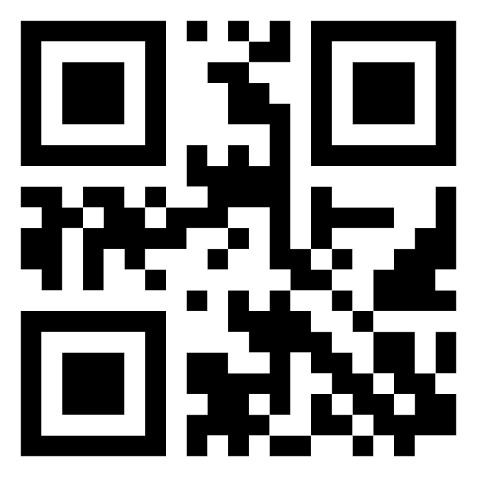

# HoloLens2_App

Augmented Reality (AR) module for HoloLens 2.

## Features

  

* Assisted visualization of the quantum suitcase using real “dummy” game pieces and a physical board

* Purely assistive visualization for use with the real quantum suitcase

# Installation

1. Clone the repository:

```
git clone https://github.com/AmILabor/QuFabLab.git
```

2. Navigate to the folder:

```
hololens2_mrtk_basicinstall
```

3. Extract the archive:

```
UnityProjektohneInhalt.7z
```

4. Open the folder:

```
Doppel-Experiment
```

1. Select all subfolders (e.g., `Assets`, `Logs`, `Packages`, etc.) and copy or cut them.

2. Navigate back through the directory structure until you reach the first repository:

```
hololens2_app
```

7. Paste the copied/cut folders into this directory.
   Overwrite all existing files if prompted.

8. Delete the folder:

```
hololens2_mrtk_basicinstall
```

9. Start the project in Unity.
   A warning may appear stating that code cannot be executed or recommending Safe Mode.
   Ignore this warning and continue.

10. Open Player Settings and navigate to:

```
Other Settings
```

Enable the option:

```
Allow unsafe Code
```

(This is required for the OpenCV Asset.)

11. Create a project build, preferably in a folder outside the current project directory.

12. When the build window appears, navigate to the previously selected output folder.

13. Open:

```
Doppel-Experiment.sln
```

in Visual Studio, and start the project with the configuration:

```
Release | ARM64
```

# Integrated Packages

1. Mixed Reality Toolkit 3
   https://learn.microsoft.com/en-us/windows/mixed-reality/mrtk-unity/mrtk3-overview/

2. NuGet for Unity
   https://github.com/GlitchEnzo/NuGetForUnity

3. Unity Localization
   https://docs.unity3d.com/Packages/com.unity.localization@1.3/manual/index.html

4. NativeWebSocket
   https://github.com/endel/NativeWebSocket.git#upm

# QR Codes

## Full AR Scene

In the Quantenkoffer FullAR scene, the suitcase is automatically placed when the system detects the QR code:

```
KOFFER_PLACEMENT
```



## Half AR Scene

In the Quantenkoffer HalfAR scene, the suitcase position is detected using QR codes placed at the outer edges.
These markers allow holograms to be correctly aligned with the physical suitcase.

The required QR codes are:

```
KOFFER_BOTTOMLEFT
```


```
KOFFER_BOTTOMRIGHT
```


```
KOFFER_TOPLEFT
```


```
KOFFER_TOPRIGHT
```


# Useful Tips

* Deploying the project to the HoloLens using the Release build configuration provides significantly smoother performance compared to Debug or Master builds.

* The Localization Scene Controls can be accessed via:

```
Window -> Asset Management
```

If a language is selected and Track Changes is set to `true`, any modifications made in the scene will automatically be stored for that language.

Alternatively, you can view and edit all translations via the String Tables, also accessible through:

```
Window -> Asset Management
```

* The Recorder Window can be opened via:

```
Window -> General -> Recorder
```

This tool allows recording the Game View in its native resolution.
